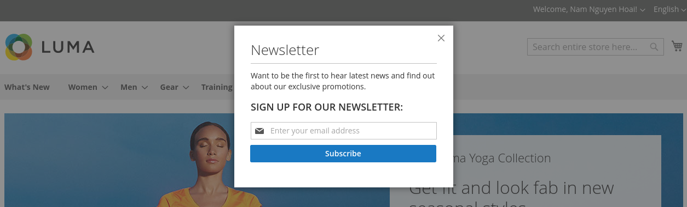

# Newsletter Popup Extension for Magento 2

The newsletter popup will be displayed on all the pages in your website, a popup will be shown after 5 seconds and require the customer to sign up for newsletters.

# How to install

```
$ composer require tieugum/newsletter
$ php bin/magento setup:upgrade
$ php bin/magento setup:di:compile
```

# Screenshot


